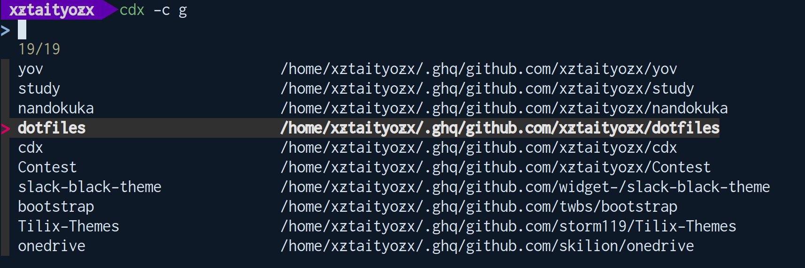

# go-cdx


cdx of Go


## Description

cdx is hyper cd command. 


cdx produce useful interface for change directory.  

- histories.
- bookmarks.
- custom sources.
- wrapping of popd/pushd


## Require

cdx requires fuzzy-finder tool like fzf.  


- [fzf](https://github.com/junegunn/fzf)
- [peco](https://github.com/peco/peco)
- etc


## Install 

### 1. Get go-cdx

### go get

```sh
$ go get github.com/xztaityozx/go-cdx
```


### binary download

Please download binary from release page.


### 2. Save basic configuration file

Please save configuration file to `~/.config/go-cdx/.go-cdx.json`

```json
{
  "HistoryFile": "~/.config/go-cdx/history.json",
  "BookMarkFile":"~/.config/go-cdx/bookmark.json",
  "Command":"pushd",
  "NoOutput":true,
  "Make":false,
  "CustomSource":[],
  "FuzzyFinder":{
    "CommandPath":"fuzzy finder",
    "Options":[]
  },
  "BinaryPath":"/path/to/go-cdx",
}

```


### 3. Load go-cdx

```sh
# activate cdx
$ eval "$(/path/to/go-cdx --init)"
# if you want activate automatically. Please write this command to ~/.zshrc or ~/.bashrc
$ echo 'eval "$(/path/to/go-cdx --init)"' >> ~/.zshrc # or ~/.bashrc
```


## Usage

```sh
go-cdx [--add|-b,--bookmark|--config [file]|
		-c,--custom [name]|--help|-h,--history|
		--init|--make|--no-output|-p,--popd|
		-v,--version] [PATH]
```


### flags

- `--add`
  - Add bookmark `$PWD`
- `-b,--bookmark`
  - bookmarks
- `--config [file]`
  - specify config file
- `-c,--custom [name]`
  - custom source. Please read details.
- `--help`
  - help for go-cdx
- `-h,--history`
  - histories
- `--init`
  - output activate command
- `--make`
  - if distnation directory could not found. cdx makes directory. This option  overwrite config.
- `--no-output`
  - disable cdx outputs. This option overwrite config
- `-p,--popd`
  - use popd
- `-v,--version`
  - output version info.


## Custom Source

You can set custom source for fuzzy finder. 


### Example

In this case. cdx from `ghq list`

In `~/.config/go-cdx/.go-cdx.json` 

```json
{
...
  "CustomSource":[
    {
      "Name":"g",
      "Command":"ghq list | xargs -n1 -I@ echo 'echo -e \"$(basename @) $(ghq root)/@\"'|bash|column -t" 
    },
  ],
...
}
```


- `Name`
  - subcommand name
- `Command`
  - Generate command for fuzzy-finder


And run `cdx --custom g`. cdx will provide fuzzy-finder interface like this.  




## Config file

| Name           | Description                                                  |
| -------------- | ------------------------------------------------------------ |
| `HistoryFile`  | /path/to/history.json                                        |
| `BookMarkFile` | /path/to/bookmark.json                                       |
| `Command`      | `pushd` or `cd`                                              |
| `NoOutput`     | Disable output                                               |
| `Make`         | if distnation directory could not found. cdx makes directory |
| `CustomSource` | list of CustomSource                                         |
| `FuzzyFinder`  | config for fuzzy-finder                                      |
| `CommandPath`  | /path/to/fuzzy-finder                                        |
| `Options`      | list of fuzzy-finder's option                                |


